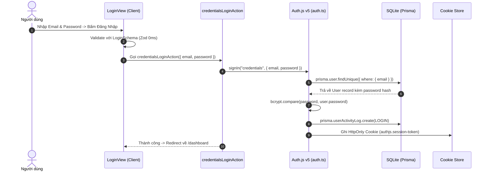
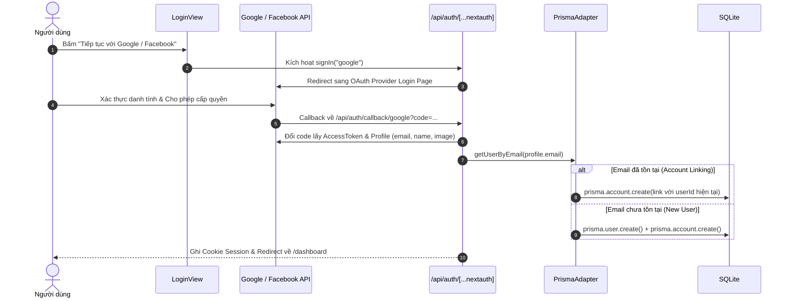
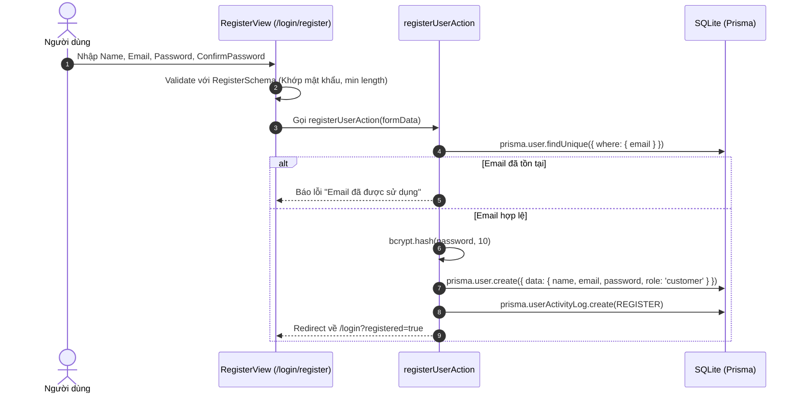
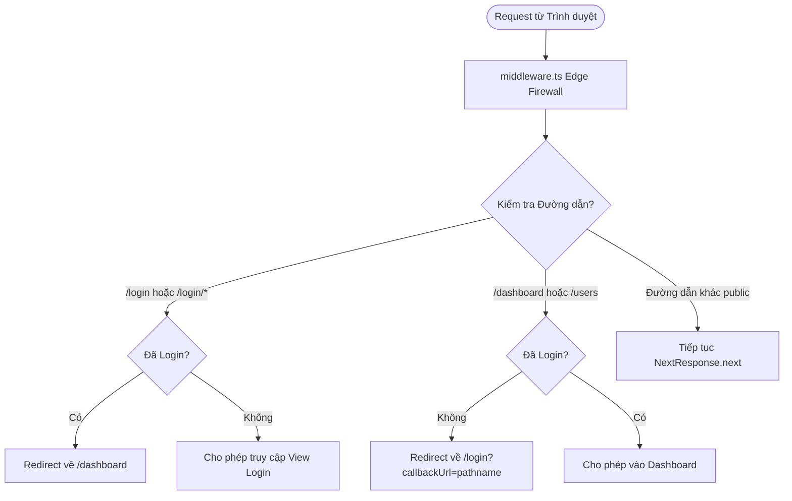

# 🧠 Cẩm Nang Kiến Trúc Xác Thực & Quản Lý State (Auth.js v5 + Prisma SQLite + Hybrid JWT)

Tài liệu này đóng vai trò là **Cẩm nang Kỹ thuật Toàn diện (Technical Specification & Runbook)** mô tả chi tiết hạ tầng Authentication, Quản lý Session, Cơ chế bảo vệ Route bằng Edge Middleware và State Management trong dự án TypiCode.

---

## 📑 MỤC LỤC
1. [Tổng Quan Kiến Trúc Auth.js v5 & Hybrid JWT](#1-tổng-quan-kiến-trúc-authjs-v5--hybrid-jwt)
2. [Kiến Trúc Hai Tầng Runtime (Two-Tier Architecture)](#2-kiến-trúc-hai-tầng-runtime-two-tier-architecture)
3. [Danh Mục & Chức Năng Chi Tiết Từng File Trong Hệ Thống](#3-danh-mục--chức-năng-chi-tiết-từng-file-trong-hệ-thống)
4. [Sơ Đồ Các Luồng Xử Lý Nghiệp Vụ (Core Workflows)](#4-sơ-đồ-các-luồng-xử-lý-nghiệp-vụ-core-workflows)
   - [Luồng 1: Đăng nhập bằng Email/Password (Credentials)](#luồng-1-đăng-nhập-bằng-emailpassword-credentials)
   - [Luồng 2: Đăng nhập OAuth & Tự động liên kết (Account Linking)](#luồng-2-đăng-nhập-oauth--tự-động-liên-kết-account-linking)
   - [Luồng 3: Đăng ký tài khoản mới (Sign Up)](#luồng-3-đăng-ký-tài-khoản-mới-sign-up)
   - [Luồng 4: Bảo vệ Route & Firewall tại Edge Middleware](#luồng-4-bảo-vệ-route--firewall-tại-edge-middleware)
5. [Cấu Trúc Cơ Sở Dữ Liệu Prisma SQLite (Schema Design)](#5-cấu-trúc-cơ-sở-dữ-liệu-prisma-sqlite-schema-design)
6. [Hướng Dẫn Sử Dụng & Đọc Session Trong Ứng Dụng](#6-hướng-dẫn-sử-dụng--đọc-session-trong-ứng-dụng)
7. [Hướng Dẫn Mở Rộng & Bảo Trì Hệ Thống (Extensibility & Maintenance)](#7-hướng-dẫn-mở-rộng--bảo-trì-hệ-thống-extensibility--maintenance)
8. [Chiến Lược State Management Toàn Cục](#8-chiến-lược-state-management-toàn-cục)

---

## 1. Tổng Quan Kiến Trúc Auth.js v5 & Hybrid JWT

Hệ thống xác thực áp dụng mô hình **Hybrid JWT Strategy** kết hợp **Prisma ORM Adapter** trên cơ sở dữ liệu SQLite:

```
┌────────────────────────────────────────────────────────────────────────────────────────┐
│                   MÔ HÌNH XÁC THỰC HYBRID JWT + PRISMA SQLITE                          │
├────────────────────────────────┬───────────────────────────────────────────────────────┤
│ 1. Tầng Database (Prisma)      │ 🗄️ Lưu trữ bền vững User, Account OAuth, Audit Log    │
│    - SQLite (dev.db)           │    - Hỗ trợ 1 User liên kết nhiều OAuth Provider      │
│    - Dễ chuyển sang Postgres   │    - Lưu mật khẩu mã hóa bcrypt an toàn               │
├────────────────────────────────┼───────────────────────────────────────────────────────┤
│ 2. Tầng Phiên Làm Việc (JWT)   │ ⚡ Mã hóa Signed JWT Claims vào HttpOnly Cookie        │
│    - Stateless Cookie Token    │    - Chứa { id, name, email, role, status, metadata } │
│    - Thời hạn 30 phút          │    - Không tốn Database Roundtrip ở mỗi request       │
├────────────────────────────────┼───────────────────────────────────────────────────────┤
│ 3. Tầng Tường Lửa (Edge)       │ 🛡️ Next.js Edge Middleware (~0.02ms)                  │
│    - V8 Edge Runtime           │    - Đọc và giải mã JWT tức thì không chạm Database   │
│    - Auto Redirect             │    - Chặn trang cấm, chuyển hướng chưa đăng nhập      │
├────────────────────────────────┼───────────────────────────────────────────────────────┤
│ 4. Tầng Feature Colocation     │ 📦 Colocated Module `app/login/_feature/`             │
│    - Catch-All Dispatcher      │    - Điều phối `/login` và `/login/register`          │
│    - 3 Trụ Cột Clean Arch      │    - Schemas -> Actions -> Views                      │
└────────────────────────────────┴───────────────────────────────────────────────────────┘
```

---

## 2. Kiến Trúc Hai Tầng Runtime (Two-Tier Architecture)

Next.js App Router phân tách môi trường thực thi thành **Edge Runtime** (cho Middleware) và **Node.js Runtime** (cho Server Actions, Route Handlers, Server Components). Do Prisma Client và Bcrypt yêu cầu các API hệ thống (fs, crypto native) không có trong Edge, kiến trúc Auth được tách thành 2 file cốt lõi:

```
apps/web/src/
├── auth.config.ts   ──► [EDGE RUNTIME]   ──► Chạy trong middleware.ts (JWT verify, Rule matching)
└── auth.ts          ──► [NODE RUNTIME]   ──► Chạy trong Server Actions & Route Handlers (Prisma, Bcrypt, Providers)
```

| Tiêu chí | `auth.config.ts` (Edge-Safe) | `auth.ts` (Node Runtime) |
| :--- | :--- | :--- |
| **Môi trường chạy** | Edge Runtime (`middleware.ts`) | Node.js Server Environment |
| **Thư viện sử dụng** | `next-auth` (core), WebCrypto | `@auth/prisma-adapter`, `prisma`, `bcryptjs` |
| **Trách nhiệm** | Kiểm tra quyền (authorized), map claims JWT | Khởi tạo Providers, kết nối Database, hash mật khẩu |
| **Tốc độ xử lý** | Siêu tốc (~0.02ms) | ~5ms - 20ms (tùy tác vụ DB) |

---

## 3. Danh Mục & Chức Năng Chi Tiết Từng File Trong Hệ Thống

| File / Đường dẫn | Tầng | Trách nhiệm & Chức năng chi tiết |
| :--- | :--- | :--- |
| [`prisma/schema.prisma`](file:///Users/dylanbui/Workspaces/_NextJs/typi-code/prisma/schema.prisma) | Database | Định nghĩa 5 Model chuẩn Auth.js: `User`, `Account` (OAuth linking), `Session`, `VerificationToken`, `UserActivityLog`. |
| [`apps/web/src/auth.config.ts`](file:///Users/dylanbui/Workspaces/_NextJs/typi-code/apps/web/src/auth.config.ts) | Core Auth (Edge) | Cấu hình trang `pages`, chiến lược `session.strategy: "jwt"`, callbacks `jwt`, `session`, và logic `authorized` cho Middleware. |
| [`apps/web/src/auth.ts`](file:///Users/dylanbui/Workspaces/_NextJs/typi-code/apps/web/src/auth.ts) | Core Auth (Node) | Tích hợp `PrismaAdapter`, cấu hình `CredentialsProvider`, `GoogleProvider`, `FacebookProvider` (bật `allowDangerousEmailAccountLinking: true`), seed demo user. |
| [`apps/web/src/app/api/auth/[...nextauth]/route.ts`](file:///Users/dylanbui/Workspaces/_NextJs/typi-code/apps/web/src/app/api/auth/[...nextauth]/route.ts) | Protocol Gateway | Route Handler tiếp nhận callbacks OAuth 2.0 / OpenID Connect từ Google & Facebook (`GET`, `POST`). |
| [`apps/web/src/middleware.ts`](file:///Users/dylanbui/Workspaces/_NextJs/typi-code/apps/web/src/middleware.ts) | Edge Firewall | Tường lửa bảo vệ các route `/dashboard`, `/users` và chuyển hướng người dùng đã login ra khỏi `/login`. |
| [`apps/web/src/lib/session.ts`](file:///Users/dylanbui/Workspaces/_NextJs/typi-code/apps/web/src/lib/session.ts) | Bridge Lib | Cung cấp hàm `getCurrentUser()` bọc trong React `cache()` đọc từ `auth()` của Auth.js, tương thích ngược toàn bộ app. |
| [`apps/web/src/app/login/[[...slug]]/page.tsx`](file:///Users/dylanbui/Workspaces/_NextJs/typi-code/apps/web/src/app/login/[[...slug]]/page.tsx) | Dispatcher Route | Nhạc trưởng điều phối URL: `/login` (đăng nhập) và `/login/register` (đăng ký). |
| [`apps/web/src/app/login/_feature/schemas/auth.schema.ts`](file:///Users/dylanbui/Workspaces/_NextJs/typi-code/apps/web/src/app/login/_feature/schemas/auth.schema.ts) | Schema Validation | Định nghĩa `LoginSchema`, `RegisterSchema` bằng Zod và danh sách `DEMO_ACCOUNTS`. |
| [`apps/web/src/app/login/_feature/actions/auth_mutations.action.ts`](file:///Users/dylanbui/Workspaces/_NextJs/typi-code/apps/web/src/app/login/_feature/actions/auth_mutations.action.ts) | Server Actions | `credentialsLoginAction` (xác thực email/mật khẩu), `registerUserAction` (tạo user SQLite), `oauthSignInAction` (kích hoạt OAuth). |
| [`apps/web/src/app/login/_feature/actions/login.actions.tsx`](file:///Users/dylanbui/Workspaces/_NextJs/typi-code/apps/web/src/app/login/_feature/actions/login.actions.tsx) | View Loaders | `indexAction` (trả về `<LoginView />`), `registerAction` (trả về `<RegisterView />`). |
| [`apps/web/src/app/login/_feature/actions/logout.action.ts`](file:///Users/dylanbui/Workspaces/_NextJs/typi-code/apps/web/src/app/login/_feature/actions/logout.action.ts) | Server Action | Gọi `signOut({ redirectTo: '/login' })` để hủy session. |
| [`apps/web/src/app/login/_feature/actions/session.action.ts`](file:///Users/dylanbui/Workspaces/_NextJs/typi-code/apps/web/src/app/login/_feature/actions/session.action.ts) | Server Action | `getCurrentSessionAction()` cho phép Client Component fetch thông tin session hiện tại. |
| [`apps/web/src/app/login/_feature/views/LoginView.tsx`](file:///Users/dylanbui/Workspaces/_NextJs/typi-code/apps/web/src/app/login/_feature/views/LoginView.tsx) | UI View | Giao diện đăng nhập đa kênh: Google, Facebook, Form Credentials, 1-Click Demo selector, báo lỗi URL parameters. |
| [`apps/web/src/app/login/_feature/views/RegisterView.tsx`](file:///Users/dylanbui/Workspaces/_NextJs/typi-code/apps/web/src/app/login/_feature/views/RegisterView.tsx) | UI View | Giao diện tạo tài khoản người dùng mới với Zod validate tức thì. |
| [`apps/web/src/app/login/_feature/stores/auth.store.ts`](file:///Users/dylanbui/Workspaces/_NextJs/typi-code/apps/web/src/app/login/_feature/stores/auth.store.ts) | Client Store | Zustand store quản lý `user`, `timeLeft` session đếm ngược trên Navbar/Dashboard. |
| [`apps/web/src/app/login/_feature/index.ts`](file:///Users/dylanbui/Workspaces/_NextJs/typi-code/apps/web/src/app/login/_feature/index.ts) | Barrel Export | Export tập trung toàn bộ Schemas, Actions, Views, Stores của module login. |

---

## 4. Sơ Đồ Các Luồng Xử Lý Nghiệp Vụ (Core Workflows)

### Luồng 1: Đăng nhập bằng Email/Password (Credentials)



---

### Luồng 2: Đăng nhập OAuth & Tự động liên kết (Account Linking)



---

### Luồng 3: Đăng ký tài khoản mới (Sign Up)



---

### Luồng 4: Bảo vệ Route & Firewall tại Edge Middleware



---

## 5. Cấu Trúc Cơ Sở Dữ Liệu Prisma SQLite (Schema Design)

Mô hình ERD chuẩn hóa cho Auth.js v5:

```prisma
// 1. User: Thông tin tài khoản người dùng
model User {
  id            String          @id @default(cuid())
  name          String?
  email         String?         @unique
  emailVerified DateTime?
  image         String?
  password      String?         // bcrypt hash
  role          String          @default("customer") // admin, customer, staff
  status        String          @default("active")
  metadata      String?         // JSON settings
  createdAt     DateTime        @default(now())
  updatedAt     DateTime        @updatedAt

  accounts      Account[]
  sessions      Session[]
  activityLogs  UserActivityLog[]
}

// 2. Account: Lưu trữ liên kết đa tài khoản (Google, Facebook, Credentials)
model Account {
  id                String  @id @default(cuid())
  userId            String
  type              String
  provider          String  // "google", "facebook", "credentials"...
  providerAccountId String  // Unique Provider ID
  refresh_token     String?
  access_token      String?
  expires_at        Int?
  token_type        String?
  scope             String?
  id_token          String?
  session_state     String?

  user              User    @relation(fields: [userId], references: [id], onDelete: Cascade)
  @@unique([provider, providerAccountId])
}
```

---

## 6. Hướng Dẫn Sử Dụng & Đọc Session Trong Ứng Dụng

### 6.1. Trong Server Component & Server Action (Khuyên dùng)
Sử dụng hàm helper `getCurrentUser()` đã bọc sẵn `React.cache()`:

```tsx
import { getCurrentUser } from '@/lib/session';
import { redirect } from 'next/navigation';

export default async function AdminDashboardPage() {
  const user = await getCurrentUser();
  if (!user || user.userRole !== 'admin') {
    redirect('/login');
  }

  return <div>Xin chào Quản trị viên: {user.userName} ({user.userEmail})</div>;
}
```

### 6.2. Trong Client Component
Sử dụng `useAuthStore` từ Zustand hoặc gọi action `getCurrentSessionAction()`:

```tsx
'use client';

import { useAuthStore } from '@/app/login/_feature';

export function UserBadge() {
  const user = useAuthStore((state) => state.user);
  if (!user) return <span>Chưa đăng nhập</span>;

  return <span>{user.userName} - {user.userRole}</span>;
}
```

---

## 7. Hướng Dẫn Mở Rộng & Bảo Trì Hệ Thống (Extensibility & Maintenance)

### 7.1. Bổ sung thêm OAuth Provider (Ví dụ: GitHub)
1. Mở file [apps/web/src/auth.ts](file:///Users/dylanbui/Workspaces/_NextJs/typi-code/apps/web/src/auth.ts).
2. Import `GitHub from 'next-auth/providers/github'`.
3. Thêm vào mảng `providers`:
   ```ts
   GitHub({
     clientId: process.env.AUTH_GITHUB_ID,
     clientSecret: process.env.AUTH_GITHUB_SECRET,
     allowDangerousEmailAccountLinking: true,
   }),
   ```
4. Thêm nút bấm đăng nhập GitHub trên [LoginView.tsx](file:///Users/dylanbui/Workspaces/_NextJs/typi-code/apps/web/src/app/login/_feature/views/LoginView.tsx).

### 7.2. Chuyển đổi Cơ sở dữ liệu sang PostgreSQL / MySQL cho Production
1. Mở file [prisma/schema.prisma](file:///Users/dylanbui/Workspaces/_NextJs/typi-code/prisma/schema.prisma).
2. Sửa `provider = "postgresql"` và `url = env("DATABASE_URL")`.
3. Chạy lệnh:
   ```bash
   npx prisma db push
   npx prisma generate
   ```
4. **Không cần sửa bất kỳ dòng code auth nào** vì `PrismaAdapter` tự động tương thích 100%.

---

## 8. Chiến Lược State Management Toàn Cục

Hệ thống kết hợp hài hòa 6 tầng State:
1. **Server State:** TanStack Query v5 / Server Actions Loaders nạp dữ liệu từ API.
2. **Global Client UI State:** Zustand siêu nhẹ cho Cart, Theme, Session đếm ngược.
3. **Validation State:** Zod Isomorphic dùng chung giữa Form và Server Action.
4. **URL State:** `useSearchParams` đồng bộ trạng thái lọc và tìm kiếm lên URL.
5. **Edge Session State:** Signed Claims JWT tại Edge Middleware.
6. **Persistent Database State:** Prisma SQLite lưu trữ thông tin tài khoản và audit logs.
