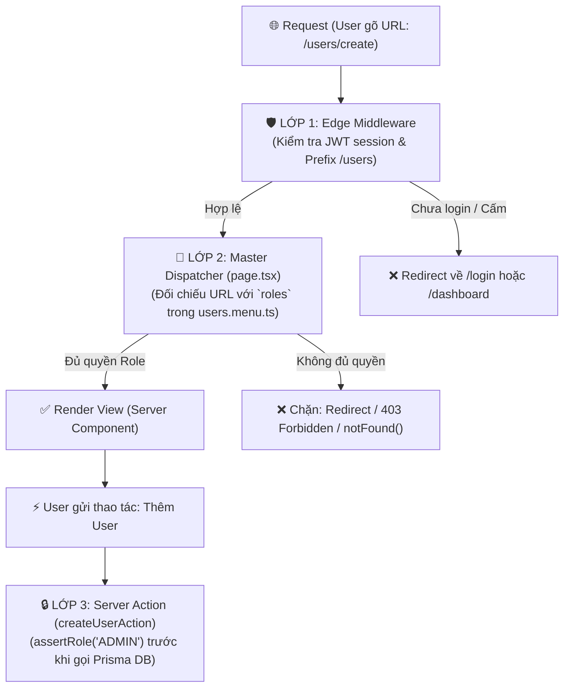

# 🛡️ CẨM NANG THIẾT KẾ PHÂN QUYỀN (PERMISSION & RBAC ARCHITECTURE)

> **Tài liệu định hướng kiến trúc (Architecture Blueprint & Future Roadmap)**
> Mô hình phân quyền: **Role-Based Access Control (RBAC) + Modular Menu Config + 3-Layer Defense (Edge, Dispatcher, Server Action)**.

---

## 📑 MỤC LỤC
1. [Triết Lý Phân Quyền Trong Kiến Trúc TypiCode](#1-triết-lý-phân-quyền-trong-kiến-trúc-typicode)
2. [Cấu Trúc Khai Báo Quyền Tại Từng Module (`*.menu.ts`)](#2-cấu-trúc-khai-báo-quyền-tại-từng-module-menuts)
3. [Mô Hình Bảo Vệ 3 Lớp Khi Người Dùng Gõ URL Trực Tiếp](#3-mô-hình-bảo-vệ-3-lớp-khi-người-dùng-gõ-url-trực-tiếp)
4. [Hướng Dẫn Tích Hợp Chi Tiết (Từng Bước Triển Khai)](#4-hướng-dẫn-tích-hợp-chi-tiết-từng-bước-triển-khai)
   - [Lớp 1: Edge Middleware Guard (Tường lửa ~0.02ms)](#lớp-1-edge-middleware-guard-tường-lửa-002ms)
   - [Lớp 2: Master Dispatcher Guard (Tự động tra cứu `*.menu.ts`)](#lớp-2-master-dispatcher-guard-tự-động-tra-cứu-menuts)
   - [Lớp 3: Server Action / Mutation Guard (`'use server'`)](#lớp-3-server-action--mutation-guard-use-server)
5. [Quy Tắc Xử Lý Trạng Thái 403 Forbidden & 404 Not Found](#5-quy-tắc-xử-lý-trạng-thái-403-forbidden--404-not-found)

---

## 1. 🎯 TRIẾT LÝ PHÂN QUYỀN TRONG KIẾN TRÚC TYPICODE

1. **"Single Source of Truth" (Nguồn chân lý duy nhất)**: File `*.menu.ts` trong từng module là nơi khai báo danh sách đường link lẫn quyền hạn (`roles?: string[]`) được phép truy cập.
2. **"Defense in Depth" (Phòng thủ đa tầng)**: 
   - Ẩn menu trên sidebar chỉ là tầng **UX**.
   - Nếu người dùng cố tình gõ link trên thanh địa chỉ trình duyệt, hệ thống sẽ chặn đứng ở tầng **Server Dispatcher** hoặc **Edge Middleware**.
   - Khi thực hiện tác vụ ghi/xóa dữ liệu, **Server Actions** kiểm tra quyền thêm một lần nữa.



---

## 2. 📋 CẤU TRÚC KHAI BÁO QUYỀN TẠI TỪNG MODULE (`*.menu.ts`)

Mỗi module tự quản lý file `[module].menu.ts` đặt tại thư mục gốc của module (ví dụ `apps/web/src/app/(main)/users/users.menu.ts`):

```typescript
import { MenuModule } from '@/components/navigation';

export const usersMenu: MenuModule = {
  id: 'users',
  title: 'Quản Lý Người Dùng',
  order: 40,
  icon: 'bi-people',
  roles: ['admin'], // 🔒 Cấp module: Chỉ role 'admin' mới thấy và vào được module này
  children: [
    {
      id: 'users-list',
      title: 'Danh sách người dùng',
      path: '/users',
      icon: 'bi-person-lines-fill',
      roles: ['admin', 'manager'], // 🔒 Quyền cấp link con
    },
    {
      id: 'users-create',
      title: 'Thêm người dùng mới',
      path: '/users/create',
      icon: 'bi-person-plus',
      roles: ['admin'],            // 🔒 Chỉ riêng 'admin' được tạo
    },
  ],
};
```

---

## 3. 🛡️ MÔ HÌNH BẢO VỆ 3 LỚP (3-LAYER DEFENSE)

### Lớp 1: Edge Middleware Guard (`apps/web/src/middleware.ts`)
Kiểm tra nhanh tính hợp lệ của session và chặn đứng những module cấm hoàn toàn theo tiền tố URL:

```typescript
// apps/web/src/middleware.ts
export default auth((req) => {
  const { pathname } = req.nextUrl;
  const userRole = req.auth?.user?.role;

  // Ví dụ: Chặn toàn bộ /users nếu không phải admin
  if (pathname.startsWith('/users') && userRole !== 'admin') {
    return NextResponse.redirect(new URL('/dashboard?error=forbidden', req.url));
  }

  return NextResponse.next();
});
```

---

### Lớp 2: Master Dispatcher Guard (Tự Động Tra Cứu Menu Config)
Tạo helper `assertModulePermission` trong `@/components/navigation/menu.guard.ts` để tái sử dụng:

```typescript
// apps/web/src/components/navigation/menu.guard.ts
import { auth } from '@/auth';
import { redirect } from 'next/navigation';
import { MenuModule, UserRole } from './menu.types';

export async function assertModulePermission(menuConfig: MenuModule, currentPath: string) {
  const session = await auth();
  const userRole = (session?.user as any)?.role as UserRole;

  // 1. Kiểm tra quyền cấp Module
  if (menuConfig.roles && menuConfig.roles.length > 0) {
    if (!userRole || !menuConfig.roles.includes(userRole)) {
      redirect('/dashboard?error=unauthorized_module');
    }
  }

  // 2. Kiểm tra quyền chi tiết cấp Action/Link
  const matchingAction = menuConfig.children.find(
    (item) => currentPath === item.path || currentPath.startsWith(`${item.path}/`)
  );

  if (matchingAction?.roles && matchingAction.roles.length > 0) {
    if (!userRole || !matchingAction.roles.includes(userRole)) {
      redirect('/dashboard?error=unauthorized_action');
    }
  }
}
```

Tích hợp vào `[[...slug]]/page.tsx` qua hook `before` của `dispatchAction`:

```tsx
// apps/web/src/app/(main)/users/[[...slug]]/page.tsx
import * as userActions from '@/app/(main)/users/_feature';
import { dispatchAction } from '@repo/shared';
import { usersMenu } from '../users.menu';
import { assertModulePermission } from '@/components/navigation/menu.guard';

export default async function UsersMasterPage({ params, searchParams }: PageProps) {
  const { slug } = await params;
  const rawSearchParams = await searchParams;
  const currentPath = `/users${slug && slug.length > 0 ? '/' + slug.join('/') : ''}`;

  return await dispatchAction(userActions, slug, rawSearchParams, {
    moduleName: 'Users',
    // 🛡️ Tự động chặn khi user cố gõ URL
    before: async () => {
      await assertModulePermission(usersMenu, currentPath);
    },
  });
}
```

---

### Lớp 3: Server Action Mutation Guard (`_mutations.server.ts`)
Luôn xác thực session và role trước khi thực hiện các mutation thao tác với cơ sở dữ liệu:

```typescript
// apps/web/src/app/(main)/users/_feature/actions/users_mutations.server.ts
'use server';

import { auth } from '@/auth';
import { prisma } from '@/lib/prisma.server';

export async function deleteUserMutation(userId: string) {
  const session = await auth();
  
  if ((session?.user as any)?.role !== 'admin') {
    throw new Error('403 Forbidden: Chỉ Admin mới có quyền xóa người dùng.');
  }

  return await prisma.user.delete({ where: { id: userId } });
}
```

---

## 4. 🎭 BỘ LỌC MENU DÀNH CHO CLIENT (`layout.tsx`)

Để người dùng không nhìn thấy các menu mình không có quyền trên Sidebar, hàm `getAuthorizedMenu` trong `menu.registry.ts` sẽ tự động lọc theo role của user:

```typescript
// apps/web/src/app/(main)/layout.tsx
import { auth } from '@/auth';
import { SidebarTreeMenu, getAuthorizedMenu } from '@/components/navigation';

export default async function MainGroupLayout({ children }: { children: React.ReactNode }) {
  const session = await auth();
  const userRole = (session?.user as any)?.role;

  // 🛡️ Lọc danh sách menu an toàn tại Server trước khi render Sidebar
  const authorizedMenus = getAuthorizedMenu(userRole);

  return (
    <div>
      <SidebarTreeMenu modules={authorizedMenus} />
      {children}
    </div>
  );
}
```

---

## 5. 📑 TỔNG KẾT BẢNG QUY TRÌNH CHECKLIST KHI THÊM MODULE MỚI

Khi tạo module mới cần phân quyền:
1. Tạo `[module].menu.ts` tại thư mục gốc module.
2. Khai báo các `roles` được phép truy cập (`roles: ['admin']`).
3. Đăng ký module vào `menu.registry.ts` và gán chỉ số `order`.
4. Gắn `assertModulePermission` vào `before` hook của `dispatchAction` trong `[[...slug]]/page.tsx`.
5. Tạo `layout.tsx`, `loading.tsx`, `error.tsx`, `not-found.tsx` riêng cho module nếu cần tùy biến giao diện.
